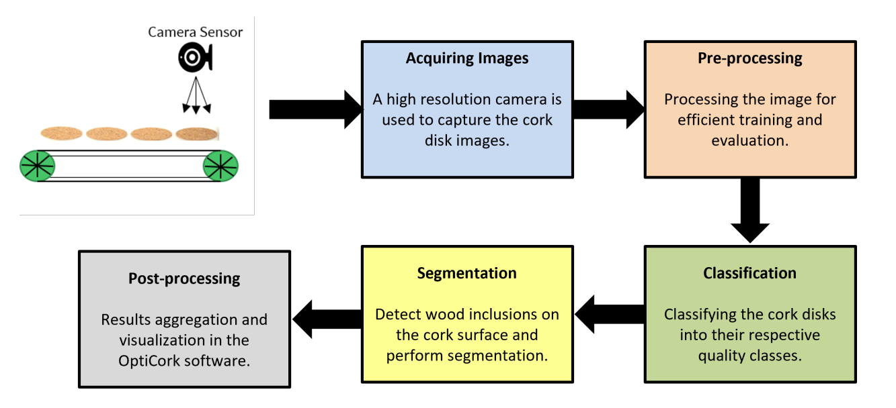
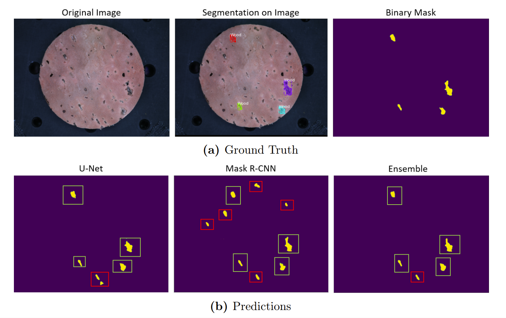

# OptiCork-thesis

## :bookmark_tabs: About OptiCork: A Segmentation-Based Computer Vision Approach for Detecting Anomalies on Cork Disk Surfaces

* This work introduces an innovative approach to automate the identification and prediction of anomalies on cork disk surfaces for quality inspection.
* Developed as part of my Master's Thesis, in the Computer Vision and Image Processing Group at the University of Freiburg. 
* Leveraging Convolutional Neural Networks, specifically U-Net and Mask R-CNN, a robust image processing pipeline is developed.



* Images from a high-resolution camera are analyzed in real-time, detecting defects with high precision.
* The unique strength of each model is harnessed through a weighted average ensemble method, resulting in superior performance compared to individual models.
* Please refer to the [thesis report](Literature/Debayan_sen_thesis.pdf) for detailed explanantions and experimental results!

## :open_file_folder: What's in this repo

* Python source code of Mask RCNN TF2, Mobile Mask RCNN, U-Net, KMeans Clustering, EfficientNet for Classification, and some other segmentation models for semantic segmentation.
* Source code for the Ensemble approach to combine multiple models for better predictions.
* Plots explaining the training performance.
* Examples codes in Jupyter Notebook to implement the above models and visualize the results.

## Installation

1. Clone this repository.

2. Build and run the docker. The given Dockerfile builds an image to run Jupyter notebook with Keras and other dependencies required for the task of segmentation.

    ``` 
    $ cd keras_docker 

    $ docker build -t <dfile_image_name> .

    $ docker run --rm -it --gpus all -p 8888:8888 -p 6006:6006 \
    --name jupyter_${USER} --user $(id -u ${USER}):$(id -g ${USER}) \
    -v $PWD:/tf/notebooks/home -v /mnt/hdd_1:/tf/notebooks/hdd_1 <dfile_image_name>
    ```
 3. Some other useful commands to work with Docker:
    ```
    docker ps -a                     //To see the status of docker processes
    docker images                    //To see the list of available docker images 
    docker stop <docker_name>        //To stop a docker process
    docker rmi <docker_image_name>   //To remove an image from the local system
    ``` 
 
 
 4. The segmentation can be performed with Mask R-CNN, U-Net or Ensemble learning method. All the steps to run the segmentation models are implemented in a Jupyter notebook present in the respective folders.

### Demo Result
An example of a prediction obtained from weighted average ensemble of U-Net and Mask R-CNN models. In the Figure, true positives are marked by green and false positives are marked by red.



## :pencil: Citation
If you use our codes, please cite our paper ([arXiv][arXivLink], [IEEE *Xplore*][patchworkppIEEElink])
```
@inproceedings{lee2022patchworkpp,
    title={{Patchwork++: Fast and robust ground segmentation solving partial under-segmentation using 3D point cloud}},
    author={Lee, Seungjae and Lim, Hyungtae and Myung, Hyun},
    booktitle={Proc. IEEE/RSJ Int. Conf. Intell. Robots Syst.},
    year={2022},
    pages={13276-13283}
}
```

In addition, you can also check the paper of our baseline, Patchwork. ([arXiv][patchworkarXivlink], [IEEE *Xplore*][patchworkIEEElink])
```
@article{lim2021patchwork,
    title={Patchwork: Concentric Zone-based Region-wise Ground Segmentation with Ground Likelihood Estimation Using a 3D LiDAR Sensor},
    author={Lim, Hyungtae and Minho, Oh and Myung, Hyun},
    journal={IEEE Robotics and Automation Letters},
    year={2021}
}
```
[patchworkppIEEElink]: https://ieeexplore.ieee.org/document/9981561
[patchworkarXivlink]: https://arxiv.org/abs/2108.05560
[patchworkIEEElink]: https://ieeexplore.ieee.org/document/9466396

## :triangular_flag_on_post: Tested Environment

- Ubuntu 18.04 and 20.04
- CMake 3.25.1 (>=3.20, min. Required to install Open3D)
- Open3D 0.15.2
- pybind11 v2.2.3
- Eigen 3.3.7


## :mailbox: Contact Information
If you have any questions, please do not hesitate to contact us
* [Seungjae Lee][sjlink] :envelope: `sj98lee at kaist.ac.kr`
* [Hyungtae Lim][htlink] :envelope: `shapelim at kaist.ac.kr`

[sjlink]: https://github.com/seungjae24
[htlink]: https://github.com/LimHyungTae
